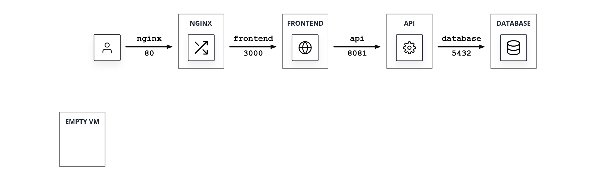
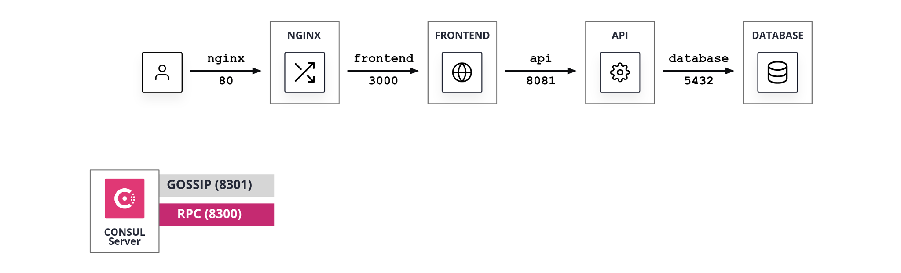
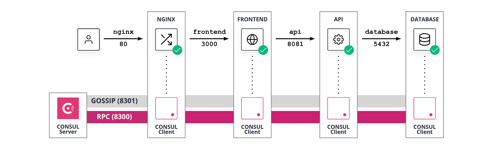
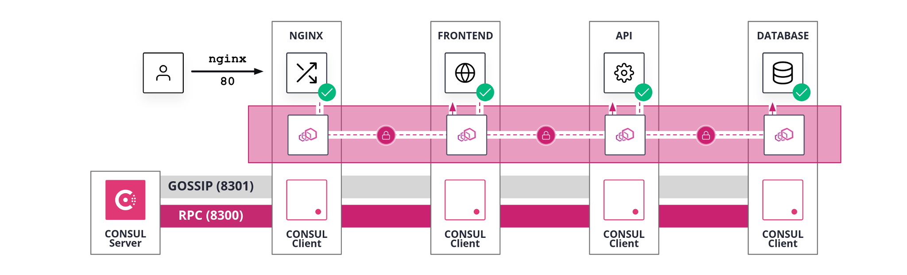

# Scenario Provision Tool

> **WARNING:** the script is currently under development. Some configurations might not work as expected. **Do not test on production environments.**

## Test scenarios

Using the pre-configured environments you can spin-up scenarios to be used in
tutorials or as test environments.

### Available environments

The environments are defined inside the `./infrastructure/aws/conf` 
folder:

```
tree ./infrastructure/aws/conf
./infrastructure/aws/conf
├── 00_hashicups.tfvars
├── 01_consul.tfvars
├── 02_service_discovery.tfvars
├── 03_service_mesh.tfvars
└── 04_service_mesh_monitoring.tfvars

0 directories, 5 files

```

### Spin-up environment

> **Info:** only AWS cloud provider scenarios are available ATM.

Use one of the configurations available as parameter for `terraform`:

```
cd ./infrastructure/aws
```

```
terraform destroy --auto-approve && \
    terraform apply --auto-approve -var-file=./conf/00_hashicups.tfvars
```

### Scenario Output

> **Info:** the tool is current active development, the info in this section 
might be outdated. Refer to the actual output of your `terraform apply` command.

```
terraform output

connection_string = "ssh -i certs/id_rsa.pem admin@`terraform output -raw ip_bastion`"
ip_api = "18.236.72.2"
ip_bastion = "35.88.138.11"
ip_consul = [
  "18.236.67.168",
]
ip_db = "18.236.150.222"
ip_fe = "34.214.10.170"
ip_nginx = "34.220.128.125"
ui_consul = "https://18.236.67.168:8443"
ui_hashicups = "http://34.220.128.125"
```

* `connection_string`: is the command you can use to connect via SSH to the 
Bastion Host. By changing the `ip_bastion` to one of the `ip_*` output names you
can connect to the respective host.

* `ip_bastion`: Public IP of the *Bastion Host*. This is a VM containing all necessary tools to interact with the environment. The tool uses this host as a entrypoint into the environment and as a centralized scenario orchestrator. Read more on [Bastion Host](./docs/BastionHost.md).

* `ip_*`: Public IP of the `*` host. Used for UI and SSH connections.

* `ui_consul`: UI for Consul Control Plane. Some scenario do not start Consul
servers or do not deploy an HCP Consul cluster. In those scenarios the URL will 
not work or might be empty. This is expected for those scenarios that test the
Consul daemon lifecycle.

* `ui_hashicups`: UI for the test application, HashiCups, deployed in all 
scenarios. For most scenarios the UI corresponds to the `nginx` host.

## The demo application

All the scenarios include a demo application, *HashiCups*, used to demonstrate Consul features in a setting that can mimic real-life deployments.

Read more in the [HashiCups Demo Application](./docs/HashiCups.md) page.

## Scenarios

Here a brief description of the available scenarios.

### 00_hashicups

Deploy:

```
terraform apply --auto-approve -var-file=./conf/00_hashicups.tfvars
```



* HashiCups application installed on 4 VMs
* One empty VM ready to host Consul server
* One *Bastion Host* VM with all tools pre-installed to interact with the environment.

### 01_consul

Deploy:

```
terraform apply --auto-approve -var-file=./conf/01_consul.tfvars
```



* All steps of scenario `00_hashicups`.
* Consul server configured for TLS and Gossip encryption and with restrictive ACL defaults.
* Consul server running.
* Consul ACL system initialized.
* Restricted token applied to the Consul server agent.

### 02_service_discovery

Deploy:

```
terraform apply --auto-approve -var-file=./conf/02_service_discovery.tfvars
```



* All steps of scenario `01_consul`.
* `for each service`
    * Consul client configured for TLS and Gossip encryption and with restrictive ACL defaults.
    * Consul client tokens generated and added to the Consul configuration.
    * Service discovery configuration files created and added the the Consul configuration.
    * Consul client running

### 03_service_mesh

Deploy:

```
terraform apply --auto-approve -var-file=./conf/03_service_mesh.tfvars
```



* All steps of scenario `02_service_discovery`.
* `for each service`
    * Consul service mesh configuration files created for the service and added to the Consul configuration replacing the service discovery configuration.
    * Consul client agent restarted to apply the configuration change
    * Envoy sidecar proxy running
    * Service process configuration change to use only `localhost` references.
    * Service process restarted to listen on `localhost` interface only.
* Permissive `* > *` intention configured,to allow traffic.


### 04_service_mesh_monitoring [DRAFT]

Deploy:

```
terraform apply --auto-approve -var-file=./conf/04_service_mesh_monitoring.tfvars
```

* All steps of scenario `03_service_mesh`.
* Consul server configuration changed for monitoring.
* Consul server agent restarted to apply the configuration change
* `for each service`
    * Grafana agent configuration generated
    * Grafana agent process started

## Separate scripts

During the environment setup, some steps of the UX are performed using external scripts. 
Those steps are usually the operations more dependent on your specific deployment.
We detached those steps into supporting scripts to:
* provide easier reference for those steps
* avoid code drift for the core parts of the workflow

The scripts are located under the `./ops/scenarios/99_supporting_scripts/` folder:

```
tree ./ops/scenarios/99_supporting_scripts/
./ops/scenarios/99_supporting_scripts/
├── generate_consul_client_config.sh
├── generate_consul_server_config.sh
├── generate_consul_server_tokens.sh
└── generate_consul_service_config.sh

0 directories, 4 files

```

You can use the scripts in this folder as a source of inspiration for writing your custom configuration scripts.

Read more on the different scripts on the [Separate Scripts](./docs/SeparateScripts.md) page.